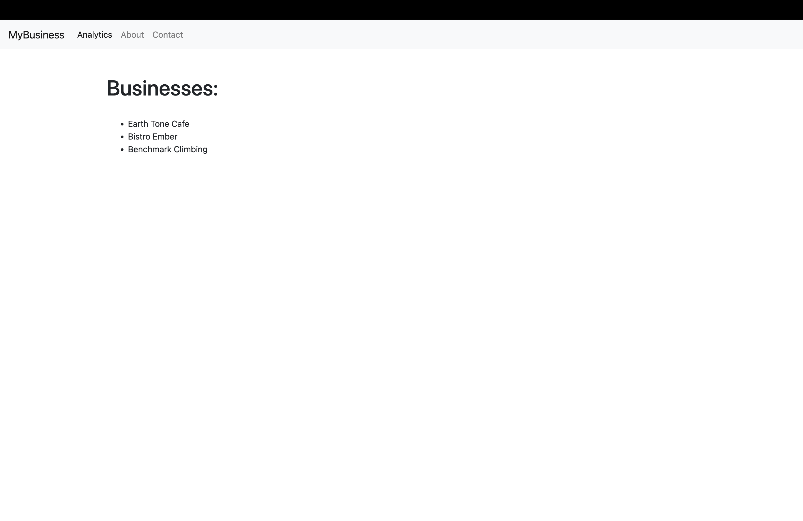
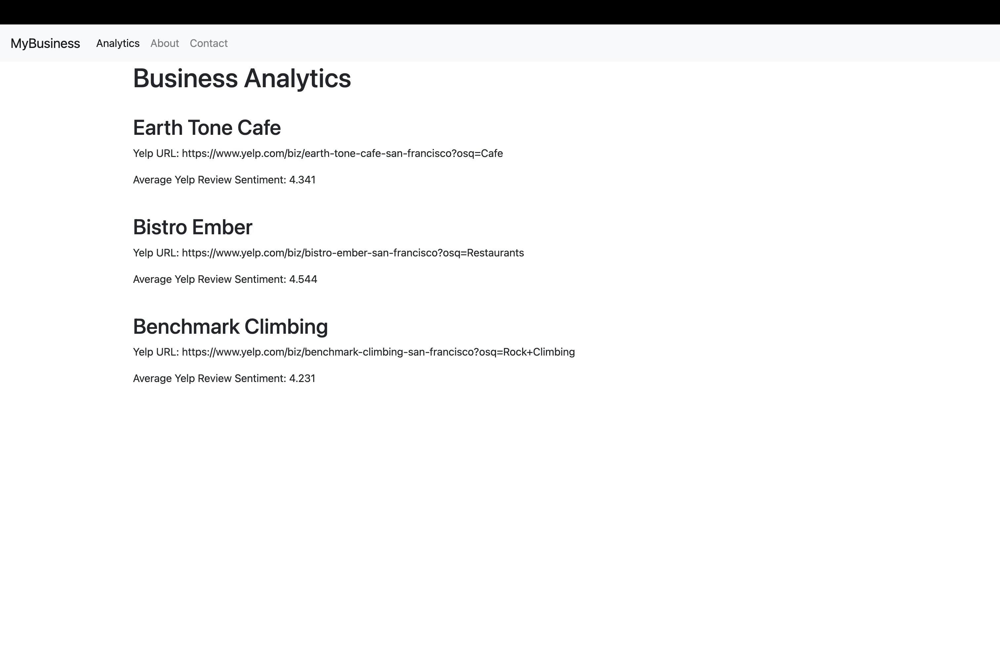
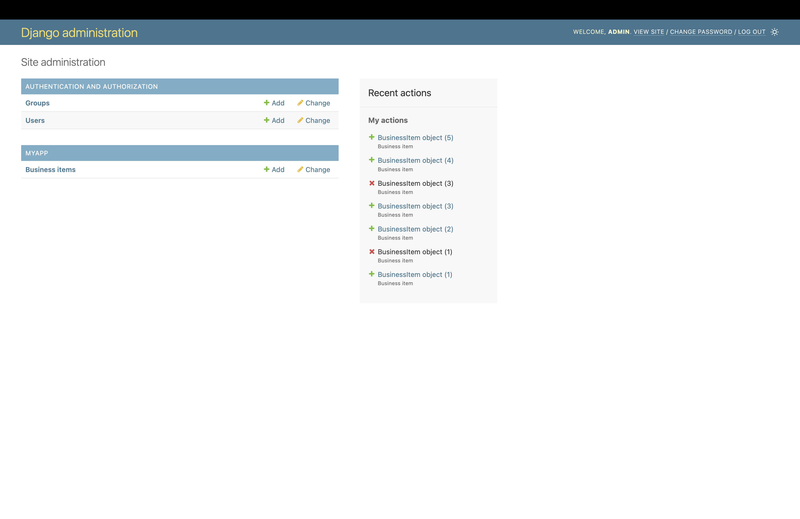
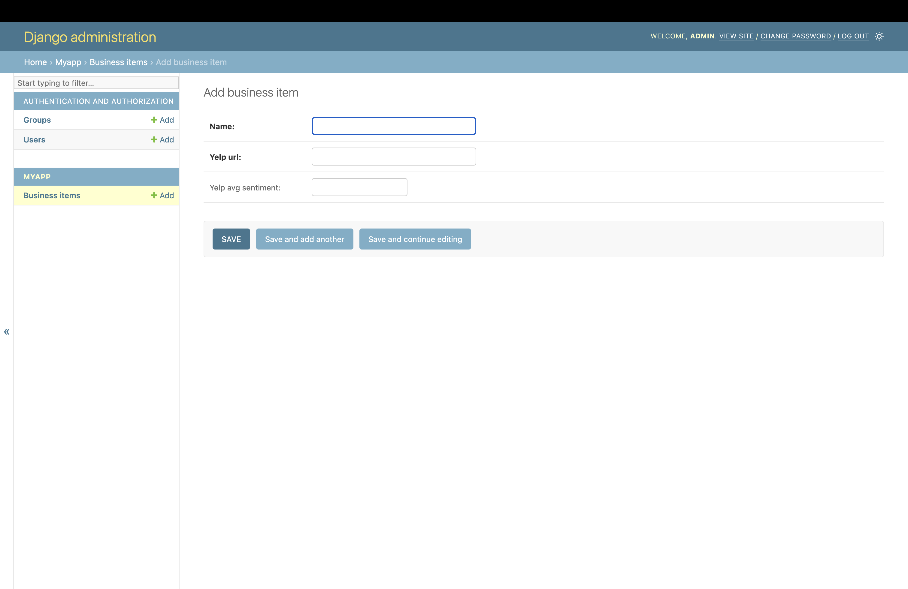

<!-- PROJECT LOGO -->
<br />
<div align="center">
  <a href="https://github.com/pakuang/reviewSentiment">
    
  </a>

<h3 align="center">Business Sentiment Analyzer</h3>

  <p align="center">
    Business analytics hub based in Django with a SQLite3 database. Yelp Review sentiment analysis supported through PyTorch, Hugging Face Transformers and pre-trained BERT model. Data parsed using BeautifulSoup. 
    <br />
    <a href="https://github.com/pakuang/ReviewSentiment"><strong>Explore the docs »</strong></a>
    <br />
    <br />
    <a href="https://github.com/pakuang/ReviewSentiment">View Demo</a>
    ·
    <a href="https://github.com/pakuang/ReviewSentiment/issues">Report Bug</a>
    ·
    <a href="https://github.com/pakuang/ReviewSentiment/issues">Request Feature</a>
  </p>
</div>


<!-- TABLE OF CONTENTS -->
<details>
  <summary>Table of Contents</summary>
  <ol>
    <li>
      <a href="#about-the-project">About The Project</a>
      <ul>
        <li><a href="#built-with">Built With</a></li>
      </ul>
    </li>
    <li><a href="#usage">Usage</a></li>
    <li>
      <a href="#getting-started">Getting Started</a>
      <ul>
        <li><a href="#installation">Installation</a></li>
      </ul>
    </li>
    <li><a href="#contact">Contact</a></li>
    <li><a href="#acknowledgments">Acknowledgments</a></li>
  </ol>
</details>


<!-- ABOUT THE PROJECT -->
## About The Project

This Business Sentiment Analyzer application hosted through a robust Django web framework helps inform the way businesses interpret customer feedback. This application seamlessly integrates natural langugae processing techniques using PyTorch, Hugging Face Transformers, and a pre-trained BERT model for accurate sentiment analysis. A SQLite3 database stores business analytics and Django's ORM Model GUI allows for easy admin accessible CRUD operations. A JupyterLab file is provided for further analysis using pandas dataframes and numpy. 

<p align="right">(<a href="#readme-top">back to top</a>)</p>


### Built With

* [![Python][Python]][Python-url]
* [![Django][Django]][Django-url]
* [![SQLite][SQLite]][SQLite-url]
* [![Pytorch][Pytorch]][Pytorch-url]
* [![Jupyter][Jupyter]][Jupyter-url]
* [![Pandas][Pandas]][Pandas-url]
* [![Numpy][Numpy]][Numpy-url]
* [![VSCode][Visual Studio Code]][VSCode-url]


<p align="right">(<a href="#readme-top">back to top</a>)</p>

<!-- USAGE EXAMPLES -->
## Usage

Main Dashboard


Business Review Analytics


Admin Dashboard and Database Management



<p align="right">(<a href="#readme-top">back to top</a>)</p>

<!-- GETTING STARTED -->
## Getting Started

To get a local copy up and running follow these simple example steps.


### Installation

1. Clone the repo
   ```sh
   git clone https://github.com/pakuang/reviewSentiment.git
   ```
2. Install dependencies in rproject oot directory
   ```sh
   pip3 install torch torchvision torchaudio
   pip3 install transformers requests beautifulsoup4 pandas numpy
   ```
3. Enter your SECRET_KEY in .env
   ```python
    SECRET_KEY= #Enter secret key here

   ```
5. Run the development server in project directory:

    ```bash
    python3 manage.py runserver
    ```
6. Open given development server with your browser to see the result. 

<p align="right">(<a href="#readme-top">back to top</a>)</p>


<!-- CONTACT -->
## Contact

Pansy Kuang - [LinkedIn](https://linkedin.com/in/pansykuang) - kuangpansy@gmail.com

Project Link: [https://github.com/pakuang/employeeMS](https://github.com/pakuang/employeeMS)

<p align="right">(<a href="#readme-top">back to top</a>)</p>


<!-- MARKDOWN LINKS & IMAGES -->
<!-- https://www.markdownguide.org/basic-syntax/#reference-style-links -->
[linkedin-shield]: https://img.shields.io/badge/-LinkedIn-black.svg?style=for-the-badge&logo=linkedin&colorB=555
[linkedin-url]: https://linkedin.com/in/pansykuang


[Visual Studio Code]: https://img.shields.io/badge/Visual%20Studio%20Code-0078d7.svg?style=for-the-badge&logo=visual-studio-code&logoColor=white
[VSCode-url]: https://code.visualstudio.com/
[Python]:https://img.shields.io/badge/python-3670A0?style=for-the-badge&logo=python&logoColor=ffdd54
[Python-url]: https://www.python.org/
[Django]: https://img.shields.io/badge/django-%23092E20.svg?style=for-the-badge&logo=django&logoColor=white
[Django-url]: https://www.djangoproject.com/
[PyTorch]:https://img.shields.io/badge/PyTorch-%23EE4C2C.svg?style=for-the-badge&logo=PyTorch&logoColor=white
[PyTorch-url]: https://pytorch.org/
[Jupyter]:https://img.shields.io/badge/jupyter-%23FA0F00.svg?style=for-the-badge&logo=jupyter&logoColor=white
[Jupyter-url]: https://jupyter.org/
[Pandas]:https://img.shields.io/badge/pandas-%23150458.svg?style=for-the-badge&logo=pandas&logoColor=white
[Pandas-url]:https://pandas.pydata.org/
[NumPy]:https://img.shields.io/badge/numpy-%23013243.svg?style=for-the-badge&logo=numpy&logoColor=white
[Numpy-url]: https://numpy.org/
[SQLite]:https://img.shields.io/badge/sqlite-%2307405e.svg?style=for-the-badge&logo=sqlite&logoColor=white
[SQLite-url]: https://www.sqlite.org/ 
